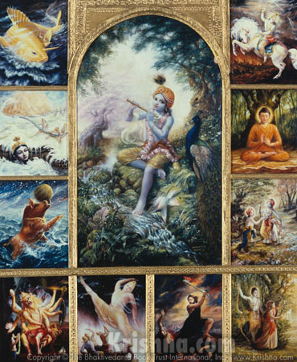

# New Year New Methods
First I did Qigong with a full Chilel set, then I did a full mantra work to evocation to the god Krishna.

Krishna is usually described as: 

*Krishna (/ˈkrɪʃnə/,[8] Sanskrit pronunciation: [ˈkr̩ʂɳə]; Sanskrit: कृष्ण, translit. Kṛṣṇa) is a major deity in Hinduism. He is worshipped as the eighth avatar of the god Vishnu and also as the supreme God in his own right.[9] He is the god of compassion, tenderness, and love in Hinduism,[1][2] and is one of the most popular and widely revered among Indian divinities.[10] Krishna's birthday is celebrated every year by Hindus on Janmashtami according to the lunisolar Hindu calendar, which falls in late August or early September of the Gregorian calendar.*

Working with this deity is purposefully working with an anathema for me.  This type of deity is not my cup of tea for alot of reasons, but when shit ain't working do something different.  I did this work Zac Lui.  

I think I got slightly more then I bargained for, and came to some heretical conclusions about the Krishna based on my verified personal gnosis. Zac got the same impressions without a direct conversation.  

I can say the insights I got would make it very easy to work with at least Krishna and Laxmi with much greater success.  Now granted even Crowley sainted Krishna, I can tell you there is a strong connection to Krishna to the occult and various "occulty" people like Mathers, and the theosophists are all in on the Krishna.

There are lots of big clues that Krishna is very tied to the archetype of the magician and part of that ( not all), is the extensive use of glamour and illusion.   The energy is such that the next day I had alot of trouble waking from the dream state and that is a BIG clue on the actual nature of the energy. Although interpreting the energy, I might have become even more cynical about religion and the religious side of occultism as theosophists and even Crowley fell into.   That said, I am pretty freaking relaxed today the day after, and care free.  That's good and bad, probably on the whole really good.

So all that means .. I got through the 30 days of body talisman and purification work ( KRISHNA totally fits into this if you read his mythology).

